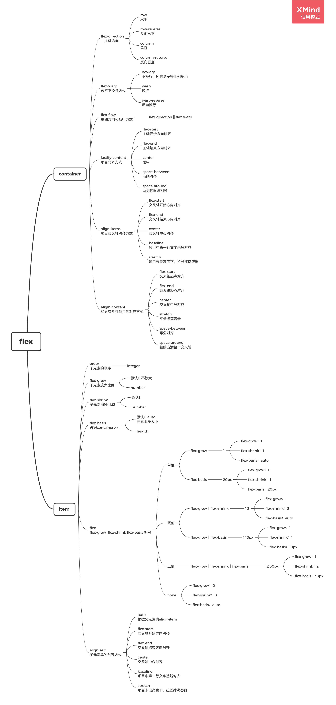

# flex

## container

### flex-direction-主轴方向
- row
水平
- row-reverse
反向水平
- column
垂直
- column-reverse
反向垂直

### flex-warp-放不下换行方式
- nowarp
不换行，所有盒子等比例缩小
- warp
换行
- warp-reverse
反向换行

### flex-flow-主轴方向和换行方式
- flex-direction || flex-warp

### justify-content-项目对齐方式
- flex-start
主轴开始方向对齐
- flex-end
主轴结束方向对齐
- center
居中
- space-between
两端对齐
- space-around
两侧的间隔相等

### align-items-项目交叉轴对齐方式

- flex-start
交叉轴开始方向对齐
- flex-end
交叉轴结束方向对齐
- center
交叉轴中心对齐
- baseline
项目中第一行文字基线对齐
- stretch
项目未设高度下，拉长撑满容器

### aligin-content-如果有多行项目的对齐方式
- flex-start
交叉轴起点对齐
- flex-end
交叉轴终点对齐
- center
交叉轴中线对齐
- stretch
平分撑满容器
- space-between
等分对齐
- space-around
轴线占满整个交叉轴

## item

### order-子元素的顺序
- integer

### flex-grow-子元素放大比例
- 默认0 不放大
- number

### flex-shrink-子元素缩小比例
- 默认1 
- number

### flex-basis-占据container大小
- 默认：auto
元素本身大小
- length

### flex
flex-grow  flex-shrink flex-basis 缩写

- 单值

	- flex-grow

		- 1

			- flex-grow：1
			- flex-shrink：1
			- flex-basis：auto

	- flex-basis

		- 20px

			- flex-grow：0
			- flex-shrink：1
			- flex-basis：20px

- 双值

	- flex-grow｜flex-shrink

		- 1 2

			- flex-grow：1
			- flex-shrink：2
			- flex-basis：auto

	- flex-grow｜flex-basis

		- 1 10px

			- flex-grow：1
			- flex-shrink：1
			- flex-basis：10px

- 三值

	- flex-grow｜flex-shrink｜flex-basis

		- 1 2 30px

			- flex-grow：1
			- flex-shrink：2
			- flex-basis：30px

- none

	- flex-grow：0
	- flex-shrink：0
	- flex-basis：auto

### align-self-子元素单独对齐方式
- auto
根据父元素的align-item
- flex-start
交叉轴开始方向对齐
- flex-end
交叉轴结束方向对齐
- center
交叉轴中心对齐
- baseline
项目中第一行文字基线对齐
- stretch
项目未设高度下，拉长撑满容器

