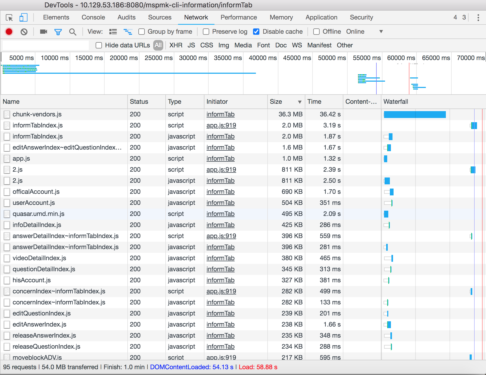

### 一个问题

在开发的过程中遇到一个问题，开发环境是在内网，连接本地服务需要使用内网wifi或者VPN。连接本地服务后，发现加载特别特别慢，并且一个页面50M流量就跑完了。最近无事，正好在看[利用网络面板做性能分析](https://time.geekbang.org/column/article/138844)的文章，就想着对在使用的脚手架做性能分析，并尝试解决加载过于缓慢的问题。

### 起

通过文章，知道可以使用network面板查看网络层面性能瓶颈。看到访问一个页面，需要请求40M的资源，本能的觉得问题在这里，这也和之前使用过程中一个页面会消耗大概50M流量比较吻合。

通过查看面板数据



发现其中，问题最大的是`chunk-vendors.js`居然有36MB，并且资源加载时间`36s`，那么问题找到了。只需要优化这个问题，就可以解决了。

### 承

通过百度`chunk-vendors.js`，知道了，这个文件是是利用CommonsChunkPlugin插件抽出公用模块打包出来的文件。大小跟你依赖的第三方库有关。

#### 可行性

先试验一下，g-zip压缩`chunk-vendors.js`效率。

将文件右键`save as`到本地

```bash
gzip chunk-vendors.js
```

发现文件从36M --->5.5M


不能说完美解决性能问题，但也算基本上解决。

说干就干。

并且百度给了解决方案，使用`compression-webpack-plugin`插件可以使用g-zip压缩，减小传输体积。

因为项目使用的是vue-cli脚手架，所以如下步骤：

1. `npm install --save-dev compression-webpack-plugin`

2. 修改`vue.config.js`配置文件

   ```js
   const CompressionWebpackPlugin = require('compression-webpack-plugin')
   
   .....
   module.exports = {
   ....
     chainWebpack: (config) => {
       // 生产环境，开启js\css压缩
       if (process.env.NODE_ENV === 'production') {
         config.plugin('compressionPlugin').use(new CompressionPlugin({
           test: /\.(js|css|less)$/, // 匹配文件名
           threshold: 10240, // 对超过10k的数据压缩
           minRatio: 0.8,
           deleteOriginalAssets: true // 删除源文件
         }))
       }
   	}
   }
   //想吐槽的是上面的compressionPlugin插件配置项中例如minRatio默认就是0.8，网上很多代码其实只需要看为什么需要他，真正使用，最好去看文档。
   ```

发现能正常启动，但是并没有效果。访问对应页面还是`40M`左右的大小。仔细看代码，发现是在生产环境才开启，那么去掉呢？

发现还是不行。但是能访问到g-zip压缩的`chunk-vendors.js.gz`资源。只是资源大小为出错的`4.5kb`，http报文显示为html类型。


通过在表格右键开启`content-encoding`功能，来判断是否开启g-zip传输。然而并没有开启g-zip压缩传输。


现在理一下掌握的信息。

1. `chunk-vendors.js`资源过大问题，普遍存在。
2. 网上教程是在使用build后，生产环境g-zip减少传输体积。
3. 我的需求是需要在开发环境，开启g-zip。

### 转

因为对webpack配置不太熟悉，导致萌生了放弃的念头，毕竟不是我的需求，我只是摸鱼杀时间的。

在看`vue.config.js`配置文件的配置项时，发现，webpack起本地服务的时候，是使用express来做服务器的。

使用devServer来写配置项。

再结合百度解决方案的时候有一个文章写需要配置gninx，来开启gzip，突然灵光乍现，会不会只用在`devServer`上配置压缩就可以了。在vue-cli文档里看到是支持`webpack-dev-server` 的所有选项，顺势找到`wenpack-dev-server`文档，文档里就有`devServer.compress`开启gzip。

只需要简单的添加一行代码

```javascript
module.exports = {
  //...
  devServer: {
    compress: true
  }
};
```

重启脚手架,令人惊喜的东西出现在面前了。


成功开启！

运行效率：


整体资源从52M--->8.5M,整体时间从4.5到1.2min---->44s，已经是能接受的范围。

### 合

#### 感想

1. webpack是团队配置好的，对于不是很熟悉的我来说（虽然看过，知道一些基本的概念），但是修改还是黑盒一样，有一种明明知道只需要修改一个地方就可以解决的，但就是不知道修改哪儿的感觉。
2. 继续好好学习webpack是很有必要的。
3. 还有就是没有大佬撑场面的公司，成长也有，可以自己解决一些具体问题，但是往往碰到解决不了的问题，无法寻求帮助，可能突然一下解决了，也可能一致放哪里，一直得不到解决。
4. 当前页面1min的白屏时间，还可以继续优化：
   1. 比如将当前页面不需要的包，treeSharking掉。
   2. 在加载完资源后，有一段长达2s的停留，可以优化掉。

